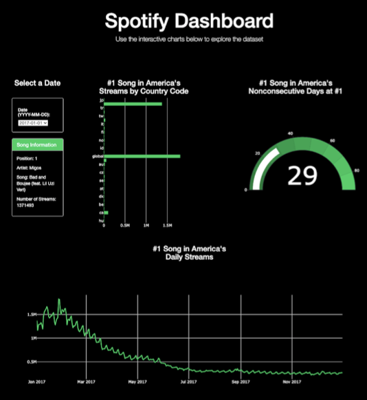

#  #1 Spotify Hits 2017
Displays the life and timeline of a song while it was #1 in the U.S. throughout the year 2017

Core Responsibilities: Presentation design, explain final dashboard visualization 

Tools used: Python, JavaScript, HTML/CSS

## Theme 
Life of #1 Song in U.S.
  * Details of the song
  * Number of streams by country
  * Cumulative days in #1 spot
  * Number of streams by date
  
## Data Munging Techniques 
Data Munging was completed in Python. The ETL process was crucial for data storage. 

1. Read CSV
2. Only Keep Dates from 2017
3. Make Copy of Data
4. Create Table in pgAdmin 4
5. Rename Columns to PostgreSQL Standards
6. Connect to PostgreSQL
7. Create Engine
8. Use “to_sql” to Load Data

